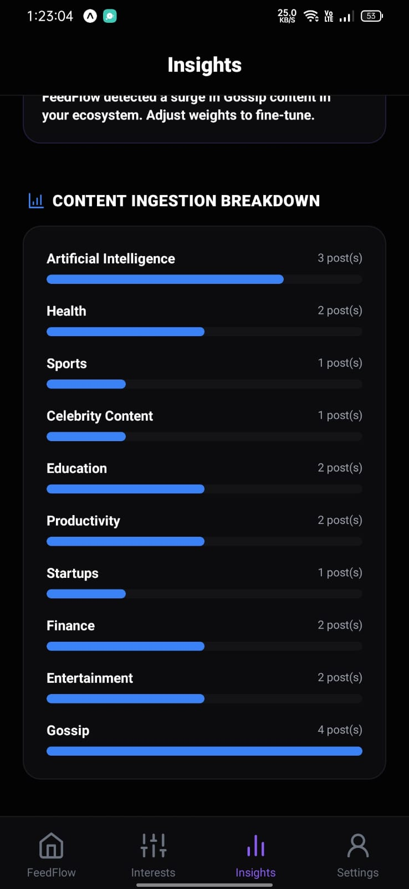
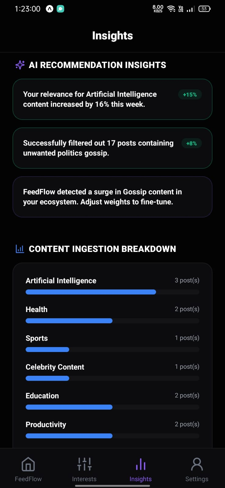
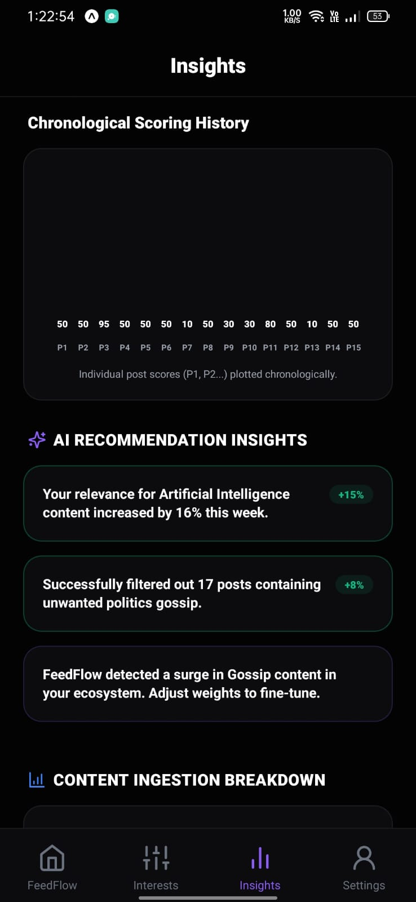
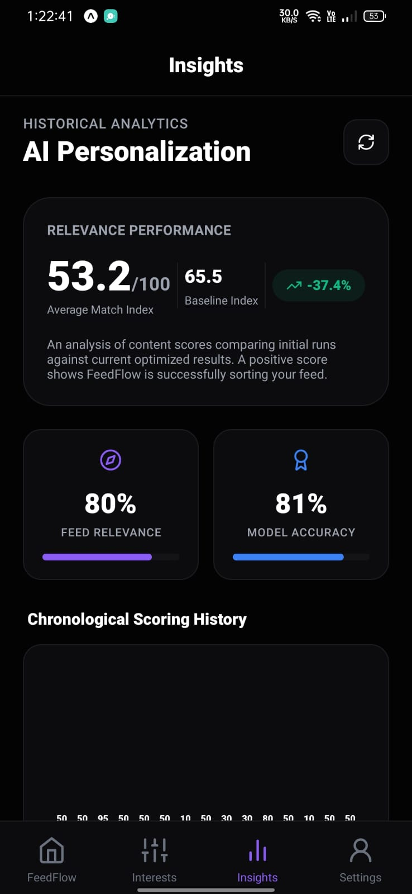
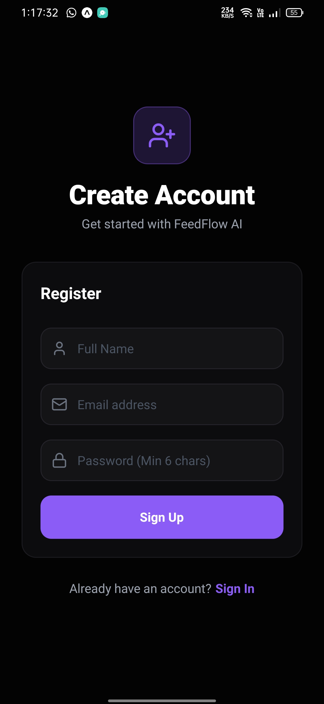
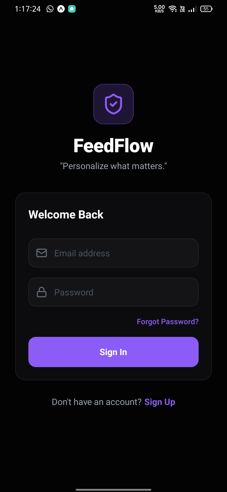
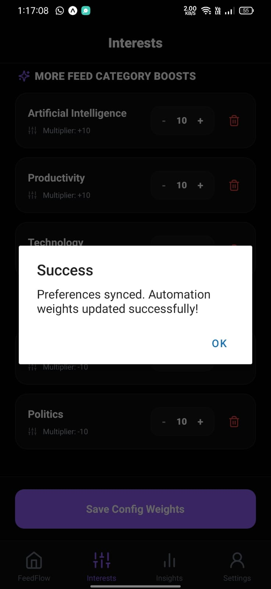
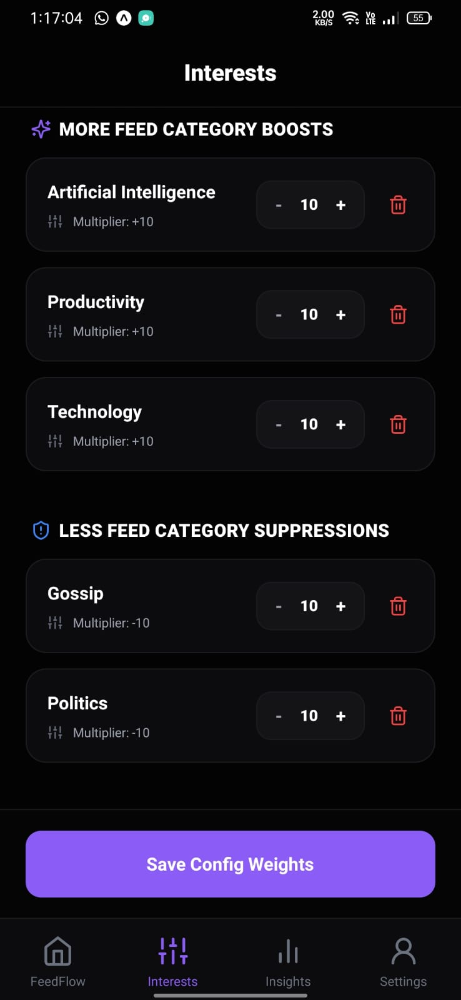
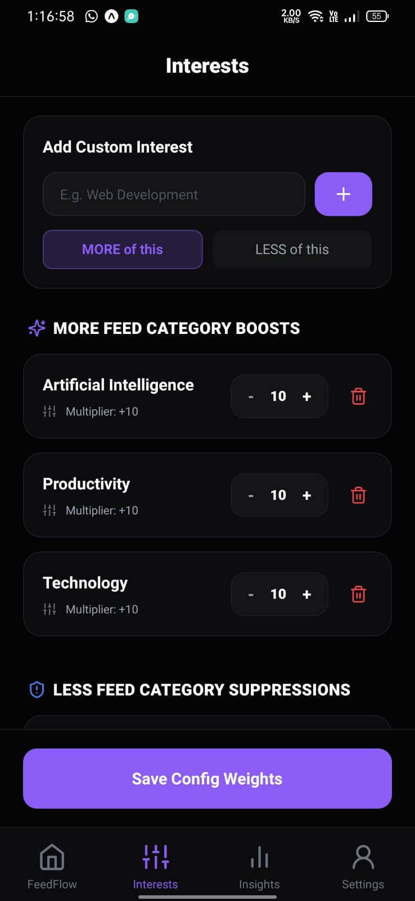

# FeedFlow - "Personalize what matters."

FeedFlow is a premium, production-ready mobile application designed to help users personalize their social ecosystem through AI-driven preference management and automation.

FeedFlow implements a simulated integration layer that grabs social posts, analyzes them with Google Gemini (falling back to a local rules engine if no API key is specified), computes custom category-relevance scores, and aggregates statistics into a dark-mode dashboard.

---

## 🗺️ Architecture Diagram

```mermaid
graph TD
    %% Frontend Layer
    subgraph Mobile_App ["React Native & Expo Client"]
        NC[App Navigation Stack] --> TS[Zustand Store]
        TS --> AC[Axios API Client]
        UI[Glassmorphic Dashboard] --> NC
        Playground[AI Playground] --> AC
    end

    %% Network / Middleware
    AC -- HTTP / JSON + JWT --&gt; Gateway[FastAPI Backend Router]

    %% Backend Layer
    subgraph Core_Backend ["FastAPI Server"]
        Gateway --> Auth[Auth Middleware]
        Gateway --> Inst[Instagram Simulator]
        Gateway --> Pref[Preferences Manager]
        Gateway --> Auto[Automation Engine]
        
        %% Services & Integrations
        Auto --> Sync[Content Sync Service]
        Sync --> Gemini[Gemini AI Service]
        
        %% Local fallbacks
        Gemini --> |API Key Available| GAPI[Google Gemini API]
        Gemini --> |Offline Fallback| RuleEngine[Local Keyword Rules Engine]
    end

    %% Database Layer
    subgraph Data_Storage ["SQLAlchemy ORM Engine"]
        Auth --> DB[(SQLite / PostgreSQL)]
        Pref --> DB
        Sync --> DB
    end

    style Mobile_App fill:#1c133a,stroke:#8B5CF6,stroke-width:2px,color:#fff
    style Core_Backend fill:#0c223c,stroke:#3B82F6,stroke-width:2px,color:#fff
    style Data_Storage fill:#141b17,stroke:#10B981,stroke-width:2px,color:#fff
```

---

## 📁 Project Structure

```
FeedFlow/
├── backend/
│   ├── database/
│   │   └── connection.py    # DB connection engine (handles SQLite & Postgres)
│   ├── models/
│   │   └── models.py        # SQLAlchemy schema definitions
│   ├── routers/
│   │   ├── auth.py          # Auth routes (registration, login, profile)
│   │   ├── preferences.py   # User interest profiles boosts/suppressions
│   │   ├── instagram.py     # Simulated OAuth profile connections
│   │   ├── automation.py    # Automation runs start/pause/manual triggers
│   │   ├── analytics.py     # Historical dashboards charts and logs
│   │   └── ai.py            # Custom playground testing endpoint
│   ├── schemas/
│   │   └── schemas.py       # Pydantic request/response validation schemas
│   ├── services/
│   │   ├── gemini_service.py # Gemini API connection & scoring logic
│   │   └── automation_service.py # Mock post generator & sync simulator
│   ├── utils/
│   │   ├── config.py        # Environment variables parser
│   │   └── security.py      # Password bcrypt hashing & JWT tokens
│   ├── main.py              # FastAPI server boot file
│   └── requirements.txt     # Backend python dependencies
│
├── frontend/
│   ├── assets/              # Native images & static resource assets
│   ├── components/          # Reusable customized buttons and charts
│   ├── navigation/
│   │   └── AppNavigator.tsx # React Navigation Bottom-Tabs & stacks
│   ├── screens/
│   │   ├── LoginScreen.tsx       # Auth entrance screen
│   │   ├── RegisterScreen.tsx    # User registration screen
│   │   ├── OnboardingScreen.tsx  # Interest checklist onboarding flow
│   │   ├── HomeScreen.tsx        # Dashboard dials, sync control & logs
│   │   ├── PreferencesScreen.tsx # Multiplier configuration screen
│   │   ├── AnalyticsScreen.tsx   # Scoring chart, distribution bar, AI coach
│   │   └── ProfileScreen.tsx     # Simulated sync setting & custom AI test sandbox
│   ├── services/
│   │   └── api.ts           # Axios request instances with JWT Interceptors
│   ├── store/
│   │   └── useStore.ts      # Zustand global state manager with storage sync
│   ├── App.tsx              # Root component loader
│   ├── babel.config.js      # NativeWind compiler plugins
│   ├── tailwind.config.js   # Tailored dark-mode brand colors
│   └── tsconfig.json        # TypeScript compile rules
└── README.md                # Project manuals & documentation
```

---

## 🔗 FastAPI API Reference

| Endpoint | Method | Security | Description |
|---|---|---|---|
| `/auth/register` | `POST` | Public | Registers a new user, provisions default interests and charts. |
| `/auth/login` | `POST` | Public | Validates email/password and returns a JWT Bearer token. |
| `/auth/profile` | `GET` | JWT Auth | Returns authenticated user details. |
| `/instagram/status`| `GET` | JWT Auth | Returns active simulated connection state. |
| `/instagram/connect`| `POST`| JWT Auth | Simulates Instagram OAuth link via username. |
| `/instagram/disconnect`| `POST`| JWT Auth | Disconnects the profile connection. |
| `/preferences` | `GET` | JWT Auth | Fetches the user's active MORE and LESS preferences. |
| `/preferences/update`| `POST`| JWT Auth | Resets and saves the list of interest rules and weights. |
| `/automation/status`| `GET` | JWT Auth | Fetches current schedule configuration state. |
| `/automation/start`| `POST`| JWT Auth | Activates background automation scheduler loop. |
| `/automation/stop` | `POST`| JWT Auth | Disables/Pauses automation loop. |
| `/automation/trigger`| `POST`| JWT Auth | Manually ingests mock posts, parses via Gemini, updates score. |
| `/analytics/dashboard`| `GET` | JWT Auth | Returns history chart series, category bars, and AI Insights. |
| `/analytics/logs` | `GET` | JWT Auth | Returns chronological activity logging feed. |
| `/ai/analyze` | `POST`| JWT Auth | Playground analysis for user custom text captions. |

---

## 🧠 Gemini AI & Personalization Logic

### 1. Ingestion & Classification
Each post caption is analyzed by Gemini:
* **Prompt**: *"Classify text into exactly one of 17 categories. Return raw JSON containing `category` and `confidence` (0.0 to 1.0)."*
* **Fallback**: An internal keyword search scans matches if the Gemini API key is missing or calls time out.

### 2. Matching Score Calculation
* User preferences are stored as rules with weight levels `1 to 10`.
* If a post belongs to a `MORE` category: `relevance_score = weight * confidence`
* If a post belongs to a `LESS` category: `relevance_score = -(weight * confidence)`
* Scores are clamped between `-10` and `10`, then normalized to a `0-100` **Personalization Match Score**:
$$\text{Match Score} = \text{int}\left( \frac{\text{relevance\_score} + 10}{20} \times 100 \right)$$
* Visual indicators, trends, and circular bars populate based on these scores.

---

## ⚙️ Environment Variables

Create a file named `.env` in the `backend/` directory:

```env
# Sign JWT tokens (generate a long secure hex string)
SECRET_KEY=feedflow_hackathon_super_secret_key_1337_lol

# Database connection URL (defaults to SQLite local file)
DATABASE_URL=sqlite:///./feedflow.db

# Google Gemini API key. Get one from Google AI Studio: https://aistudio.google.com/
# If left empty, FeedFlow falls back to the high-fidelity local keyword classifier.
GEMINI_API_KEY=your_gemini_api_key_here
```

---

## 🚀 Step-by-Step Local Running Guide

### 1. Booting the FastAPI Backend

1. Navigate to the backend directory:
   ```bash
   cd backend
   ```
2. Create and activate a Python virtual environment:
   ```bash
   python -m venv venv
   # On Windows:
   .\venv\Scripts\activate
   # On macOS/Linux:
   source venv/bin/activate
   ```
3. Install dependencies:
   ```bash
   pip install -r requirements.txt
   ```
4. Set up environment variables by copying `.env.example` to `.env` and adding credentials.
5. Run the FastAPI development server:
   ```bash
   uvicorn main:app --reload --host 0.0.0.0 --port 8000
   ```
   *Note: Using `--host 0.0.0.0` allows devices on your local network (like your phone) to connect to the backend.*
6. Open your browser and go to `http://localhost:8000/docs` to access Swagger UI.

### 2. Booting the React Native Client

1. Open a new terminal and navigate to the frontend directory:
   ```bash
   cd frontend
   ```
2. Configure the Backend URL:
   * Open [api.ts](file:///d:/FeedFlow%20AI/frontend/services/api.ts).
   * For **Simulators** (iOS Simulator/Android Emulator), the defaults are pre-configured (`localhost` / `10.0.2.2`).
   * For **Physical Devices** (testing via Expo Go on your phone), change the base URL configuration to point to your computer's local IP address (e.g. `http://192.168.1.50:8000`).
3. Install node dependencies:
   ```bash
   npm install
   ```
4. Boot the Expo development console:
   ```bash
   npm run start
   ```
5. Run the application:
   * Press `i` to open the iOS simulator.
   * Press `a` to open the Android emulator.
   * Scan the QR code using your phone's camera (iOS) or the Expo Go App (Android) to run on a physical device.

---

## 🌐 Cloud Deployment Guide

### 1. Backend Deployment (Railway / Render)
1. **GitHub Repository**: Push your code to a GitHub repository.
2. **Setup DB**: Create a PostgreSQL instance on Railway or Supabase. Get the connection URI.
3. **Provision App**: Link the `/backend` folder to a Web Service on Railway or Render.
4. **Environment Variables**: Add your environment variables to the cloud panel:
   * `SECRET_KEY` = (A secure random string)
   * `DATABASE_URL` = (Your production Postgres URL)
   * `GEMINI_API_KEY` = (Your Google Studio API key)
5. **Start Command**: Set build start command as:
   ```bash
   uvicorn backend.main:app --host 0.0.0.0 --port $PORT
   ```

### 2. Frontend Deployment (Expo EAS Build)
1. Install EAS CLI:
   ```bash
   npm install -g eas-cli
   ```
2. Log into Expo CLI:
   ```bash
   eas login
   ```
3. Initialize the project with EAS:
   ```bash
   eas project:init
   ```
4. Build the application binary for testing or app stores:
   ```bash
   eas build --platform ios
   # or
   eas build --platform android
   ```

---

## 🚀 MVP Implementation Roadmap

- [x] **Milestone 1: Backend Foundations** (SQLAlchemy DB schemas, Pydantic validations, security and JWT tokens).
- [x] **Milestone 2: Personalization & Gemini Ingestion Service** (Gemini API setup, rule score engine, high-fidelity offline fallback classifier).
- [x] **Milestone 3: FastAPI Routing Core** (Auth registration logic, Instagram OAuth simulator, user interest weights updating, job schedulers, logs).
- [x] **Milestone 4: Frontend State & Stores** (Zustand auth, connection, preferences and analytics stores synced to local storage).
- [x] **Milestone 5: Premium Screens** (Modern Dark Glassmorphism, Onboarding interest setup, dashboards, analytics, and settings playground).
- [x] **Milestone 6: Integration Testing** (Validating route operations and AI classifications).

---

## 🎥 Hackathon Demo Video Script (2-Minute Pitch)

* **[0:00 - 0:15] The Hook**: 
  *(Camera cuts to presenter)*
  "Social algorithms are designed to keep you hooked, not happy. They show you clickbait, drama, and gossip because it drives engagement metrics. But what if *you* could take back control of your feed? Welcome to **FeedFlow**—personalize what matters."

* **[0:15 - 0:40] Onboarding & Connection**:
  *(Screen recording showing the Register and 3-Step Onboarding screens)*
  "FeedFlow lets you define your own interest weights. During onboarding, I can select topics I want to boost—like Artificial Intelligence, Startups, and Productivity—and items I want to suppress—like Gossip and Politics. With one click, we link a simulated Instagram feed."

* **[0:40 - 1:10] The Dashboard & AI Sync**:
  *(Screen recording showing the Home screen, clicking 'Trigger AI Sync')*
  "Here is our premium dark dashboard. When I click 'Trigger AI Sync', our backend fetches social posts and runs them through the Google Gemini API. Gemini classifies each post—like this caption about a new LLM—matching it against my rules. The post receives a relevance score, and our Feed Personalization Index increases from a neutral 50 up to a highly-relevant 84%."

* **[1:10 - 1:40] Analytics & The AI Playground**:
  *(Screen recording navigating to the Analytics tab and then the Profile tab to test the AI Playground)*
  "In the Insights tab, we see circular progress widgets, chronological score histories, and custom AI coach tips. Best of all, we've built an AI Playground. If I type a custom post about 'SpaceX rocket launches' and click test, FeedFlow immediately hits Gemini to categorize, rate, and show how the system filters it."

* **[1:40 - 2:00] Outro**:
  *(Camera cuts back to presenter)*
  "FeedFlow proves that social media feeds don't have to be a source of stress. By putting AI in the hands of the user, we personalize what matters. Try FeedFlow today. Thank you!"

---

## 📸 Application Screenshots

<p align="center">
  
  
  
</p>
<p align="center">
  
  
  
</p>
<p align="center">
  
  
  
</p>

